# Odometry Update Loop - Robot Position Tracking Flow

## Position Tracking Algorithm Flowchart

```mermaid
flowchart TD
    START["⏰ Timer Interrupt (10ms)<br/>📁 Module: Background Task<br/>📤 Output: Wake signal"] --> LOCK["🔒 Acquire Mutex Lock<br/>📁 Module: odometry.rs<br/>🔒 Mutex: ODOMETRY_STATE.lock()<br/>📤 Output: MutexGuard&lt;OdometryState&gt;"]
    
    LOCK --> READ_SENSORS["📖 Read All Sensors<br/>📁 Module: odometry.rs<br/>📥 Input: &mut OdometryState<br/>📤 Output: Sensor readings (f64)"]
    
    subgraph SENSOR_READ ["Sensor Reading Phase"]
        READ_SENSORS --> V1_READ["📐 Vertical Wheel 1<br/>📁 Module: chassis.rs<br/>📥 Input: &TrackingWheel<br/>🧮 Math: revs × π × d ÷ gear_ratio<br/>📤 Output: distance₁ (f64 inches)"]
        READ_SENSORS --> V2_READ["📐 Vertical Wheel 2<br/>📁 Module: chassis.rs<br/>📥 Input: &TrackingWheel<br/>🧮 Math: revs × π × d ÷ gear_ratio<br/>📤 Output: distance₂ (f64 inches)"]
        READ_SENSORS --> H1_READ["📐 Horizontal Wheel 1<br/>📁 Module: chassis.rs<br/>📥 Input: &TrackingWheel<br/>🧮 Math: revs × π × d ÷ gear_ratio<br/>📤 Output: distance₁ (f64 inches)"]
        READ_SENSORS --> H2_READ["📐 Horizontal Wheel 2<br/>📁 Module: chassis.rs<br/>📥 Input: &TrackingWheel<br/>🧮 Math: revs × π × d ÷ gear_ratio<br/>📤 Output: distance₂ (f64 inches)"]
        READ_SENSORS --> IMU_READ["🧭 IMU Sensor<br/>📁 Module: vexide::devices::smart::imu<br/>📥 Input: &InertialSensor<br/>🧮 Math: degrees × π ÷ 180<br/>📤 Output: angle (f64 radians)"]
    end

    V1_READ --> CALC_DELTAS
    V2_READ --> CALC_DELTAS
    H1_READ --> CALC_DELTAS
    H2_READ --> CALC_DELTAS
    IMU_READ --> CALC_DELTAS

    CALC_DELTAS["📊 Calculate Movement Deltas<br/>📁 Module: odometry.rs<br/>📥 Input: current readings, previous readings<br/>🧮 Math: Δ = current - previous<br/>📤 Output: Δv₁, Δv₂, Δh₁, Δh₂, Δθ"]

    CALC_DELTAS --> HEADING_PRIORITY{"🧭 Heading Calculation Priority<br/>📁 Module: odometry.rs<br/>📥 Input: Available sensors<br/>📤 Output: Selected sensor type"}

    subgraph HEADING_CALC ["Heading Calculation Algorithm"]
        HEADING_PRIORITY -->|"1st Priority"| H_WHEELS["🔄 Horizontal Wheels<br/>📁 Module: odometry.rs<br/>📥 Input: Δh₁, Δh₂, offset₁, offset₂<br/>🧮 Math: Δθ = (Δh₁ - Δh₂) ÷ (offset₁ - offset₂)<br/>📤 Output: Δθ (radians)"]
        
        HEADING_PRIORITY -->|"2nd Priority"| V_WHEELS["🔄 Vertical Wheels<br/>📁 Module: odometry.rs<br/>📥 Input: Δv₁, Δv₂, offset₁, offset₂<br/>🧮 Math: Δθ = (Δv₁ - Δv₂) ÷ (offset₁ - offset₂)<br/>📤 Output: Δθ (radians)"]
        
        HEADING_PRIORITY -->|"3rd Priority"| IMU_HEADING["🧭 IMU Sensor<br/>📁 Module: odometry.rs<br/>📥 Input: Δθᵢₘᵤ<br/>🧮 Math: Δθ = Δθᵢₘᵤ<br/>📤 Output: Δθ (radians)"]
        
        HEADING_PRIORITY -->|"4th Priority"| FALLBACK["⚠️ Fallback Calculation<br/>📁 Module: odometry.rs<br/>📥 Input: Any available wheels<br/>🧮 Math: Best estimate from available data<br/>📤 Output: Δθ (radians)"]
    end

    H_WHEELS --> CALC_NEW_HEADING
    V_WHEELS --> CALC_NEW_HEADING
    IMU_HEADING --> CALC_NEW_HEADING
    FALLBACK --> CALC_NEW_HEADING

    CALC_NEW_HEADING["🎯 Update Robot Heading<br/>📁 Module: odometry.rs<br/>📥 Input: current_θ, Δθ<br/>🧮 Math: new_θ = current_θ + Δθ<br/>🧮      avg_θ = current_θ + Δθ/2<br/>📤 Output: new_θ, avg_θ (radians)"]

    CALC_NEW_HEADING --> SELECT_WHEELS["🛞 Select Primary Wheels<br/>📁 Module: odometry.rs<br/>📥 Input: Available TrackingWheels<br/>📤 Output: best_vertical, best_horizontal"]

    SELECT_WHEELS --> CALC_DISTANCES["📏 Calculate Linear Movement<br/>📁 Module: odometry.rs<br/>📥 Input: wheel distances, previous distances<br/>🧮 Math: Δx = current_horizontal - prev_horizontal<br/>🧮      Δy = current_vertical - prev_vertical<br/>📤 Output: Δx, Δy (inches)"]

    CALC_DISTANCES --> MOTION_CHECK{"🔍 Motion Type Check<br/>📁 Module: odometry.rs<br/>📥 Input: |Δθ|<br/>📤 Output: Motion type (straight/curved)"}

    subgraph MOTION_CALC ["Motion Calculation"]
        MOTION_CHECK -->|"Straight Line"| STRAIGHT["📐 Straight Motion<br/>📁 Module: odometry.rs<br/>📥 Input: Δx, Δy<br/>🧮 Math: local_x = Δx, local_y = Δy<br/>📤 Output: local_x, local_y"]
        
        MOTION_CHECK -->|"Curved Path"| CURVED["🌀 Arc Motion<br/>📁 Module: odometry.rs<br/>📥 Input: Δx, Δy, Δθ, offsets<br/>🧮 Math: local_x = 2sin(Δθ/2) × (Δx/Δθ + h_offset)<br/>🧮      local_y = 2sin(Δθ/2) × (Δy/Δθ + v_offset)<br/>📤 Output: local_x, local_y"]
    end

    STRAIGHT --> TRANSFORM_GLOBAL
    CURVED --> TRANSFORM_GLOBAL

    TRANSFORM_GLOBAL["🌍 Transform to Global Coordinates<br/>📁 Module: odometry.rs & pose.rs<br/>📥 Input: local_x, local_y, avg_θ, current pose<br/>🧮 Math: global_x += local_y × sin(avg_θ) + local_x × (-cos(avg_θ))<br/>🧮      global_y += local_y × cos(avg_θ) + local_x × sin(avg_θ)<br/>📤 Output: new global position (x, y, θ)"]

    TRANSFORM_GLOBAL --> UPDATE_POSE["📍 Update Robot Pose<br/>📁 Module: pose.rs<br/>📥 Input: new position (x, y, θ)<br/>📤 Output: Updated Pose struct"]

    UPDATE_POSE --> CALC_SPEEDS["🏃 Calculate Velocities<br/>📁 Module: odometry.rs<br/>📥 Input: new_pose, old_pose, dt=0.01s<br/>🧮 Math: speed = EMA((new - old)/dt, old_speed, α=0.95)<br/>📤 Output: global_speed, local_speed vectors"]

    CALC_SPEEDS --> STORE_PREVIOUS["💾 Store Current as Previous<br/>📁 Module: odometry.rs<br/>📥 Input: current sensor readings<br/>📤 Output: Updated OdometryState.prev_* fields"]

    STORE_PREVIOUS --> UNLOCK["🔓 Release Mutex Lock<br/>📁 Module: odometry.rs<br/>🔒 Mutex: ODOMETRY_STATE.lock() drops<br/>📤 Output: Lock released (automatic)"]
    
    UNLOCK --> WAIT["⏸️ Wait for Next Cycle<br/>📁 Module: Background Task<br/>📤 Output: 10ms delay"]
    
    WAIT --> START

    %% Data Flow Annotations with specific data types
    START -.->|"Timer signal"| LOCK
    LOCK -.->|"MutexGuard&lt;OdometryState&gt;"| READ_SENSORS
    V1_READ -.->|"f64 (inches)"| CALC_DELTAS
    V2_READ -.->|"f64 (inches)"| CALC_DELTAS
    H1_READ -.->|"f64 (inches)"| CALC_DELTAS
    H2_READ -.->|"f64 (inches)"| CALC_DELTAS
    IMU_READ -.->|"f64 (radians)"| CALC_DELTAS
    CALC_DELTAS -.->|"Δv₁,Δv₂,Δh₁,Δh₂,Δθ"| HEADING_PRIORITY
    H_WHEELS -.->|"Δθ (radians)"| CALC_NEW_HEADING
    V_WHEELS -.->|"Δθ (radians)"| CALC_NEW_HEADING
    IMU_HEADING -.->|"Δθ (radians)"| CALC_NEW_HEADING
    CALC_NEW_HEADING -.->|"new_θ, avg_θ"| SELECT_WHEELS
    SELECT_WHEELS -.->|"Selected wheels"| CALC_DISTANCES
    CALC_DISTANCES -.->|"Δx, Δy (inches)"| MOTION_CHECK
    STRAIGHT -.->|"local_x, local_y"| TRANSFORM_GLOBAL
    CURVED -.->|"local_x, local_y"| TRANSFORM_GLOBAL
    TRANSFORM_GLOBAL -.->|"(x,y,θ) global"| UPDATE_POSE
    UPDATE_POSE -.->|"Pose struct"| CALC_SPEEDS
    CALC_SPEEDS -.->|"Speed vectors"| STORE_PREVIOUS
    STORE_PREVIOUS -.->|"Updated state"| UNLOCK

    %% Robot Movement Scenarios
    subgraph SCENARIOS ["🚗 Robot Movement Examples"]
        FORWARD["➡️ Forward Motion<br/>📥 Input: Δy > 0, Δx ≈ 0, Δθ ≈ 0<br/>📤 Output: y coordinate increases<br/>📊 Example: Tank drive forward"]
        TURN["🔄 Pure Rotation<br/>📥 Input: Δy ≈ 0, Δx ≈ 0, Δθ ≠ 0<br/>📤 Output: θ changes, position stable<br/>📊 Example: Point turn"]
        STRAFE["⬅️ Strafe (Holonomic)<br/>📥 Input: Δy ≈ 0, Δx > 0, Δθ ≈ 0<br/>📤 Output: x coordinate increases<br/>📊 Example: X-drive sideways"]
        ARC["🌀 Arc Movement<br/>📥 Input: Δy > 0, Δx > 0, Δθ > 0<br/>📤 Output: curved path in global frame<br/>📊 Example: Turning while driving"]
    end

    %% Styling
    classDef startend fill:#ffebee,stroke:#c62828,stroke-width:3px
    classDef sensors fill:#e8f5e8,stroke:#2e7d32,stroke-width:2px
    classDef calculation fill:#e3f2fd,stroke:#1565c0,stroke-width:2px
    classDef decision fill:#fff3e0,stroke:#ef6c00,stroke-width:2px
    classDef motion fill:#f3e5f5,stroke:#7b1fa2,stroke-width:2px
    classDef storage fill:#fce4ec,stroke:#c2185b,stroke-width:2px
    classDef examples fill:#f1f8e9,stroke:#558b2f,stroke-width:2px

    class START,UNLOCK startend
    class V1_READ,V2_READ,H1_READ,H2_READ,IMU_READ sensors
    class CALC_DELTAS,CALC_NEW_HEADING,TRANSFORM_GLOBAL,CALC_SPEEDS calculation
    class HEADING_PRIORITY,MOTION_CHECK decision
    class STRAIGHT,CURVED,H_WHEELS,V_WHEELS,IMU_HEADING,FALLBACK motion
    class STORE_PREVIOUS,UPDATE_POSE storage
    class FORWARD,TURN,STRAFE,ARC examples
```



## Mathematical Details

### Delta Calculation
```
For each sensor reading:
Δvalue = current_reading - previous_reading

Where previous_reading was stored in the last update cycle
```

### Heading Priority Algorithm
```rust
if horizontal1.is_some() && horizontal2.is_some() {
    // Highest accuracy - dedicated rotation measurement
    Δheading = (Δh1 - Δh2) / (h1_offset - h2_offset)
} else if vertical_wheels_not_powered {
    // Good accuracy - differential measurement  
    Δheading = (Δv1 - Δv2) / (v1_offset - v2_offset)
} else if imu.is_some() {
    // Direct measurement
    Δheading = Δimu
} else {
    // Fallback - use any available wheels
    Δheading = (Δv1 - Δv2) / (v1_offset - v2_offset)
}
```

### Arc Motion Calculation
```rust
// When robot follows curved path (Δheading ≠ 0)
local_x = 2.0 * sin(Δheading/2.0) * (Δx/Δheading + horizontal_offset)
local_y = 2.0 * sin(Δheading/2.0) * (Δy/Δheading + vertical_offset)

// This accounts for the arc length vs chord length difference
```

### Global Coordinate Transform
```rust
// Rotate local movement vector by average heading
avg_heading = current_heading + Δheading/2.0

global_x += local_y * sin(avg_heading)  // Forward component
global_y += local_y * cos(avg_heading)  // Forward component  
global_x += local_x * (-cos(avg_heading))  // Strafe component
global_y += local_x * sin(avg_heading)     // Strafe component
```

## Real-World Example: Robot Drives Forward and Turns Right

1. **Sensor Readings**: 
   - Vertical wheels: +10cm each (forward motion)
   - Horizontal wheels: 0cm (no strafe)
   - IMU: +5° (turning right)

2. **Delta Calculation**:
   - Δvertical = 10cm, Δhorizontal = 0cm, Δheading = 5°

3. **Motion Type**: Arc motion (Δheading ≠ 0)

4. **Local Coordinates**: 
   - local_y = 2×sin(2.5°)×(10cm/5° + 0) ≈ 9.99cm
   - local_x ≈ 0cm

5. **Global Transform**: 
   - If robot was facing 30°, avg_heading = 32.5°
   - global_x += 9.99×sin(32.5°) ≈ +5.37cm
   - global_y += 9.99×cos(32.5°) ≈ +8.42cm

6. **Result**: Robot moved forward-right in a slight arc

This process repeats every 10ms, building an accurate position estimate through sensor fusion and mathematical modeling of robot kinematics.